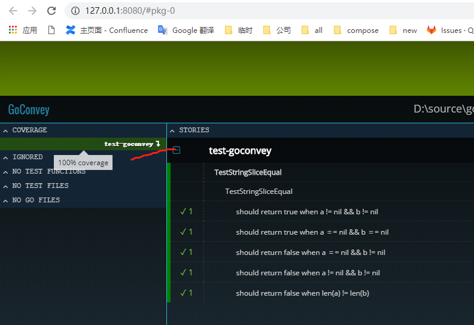
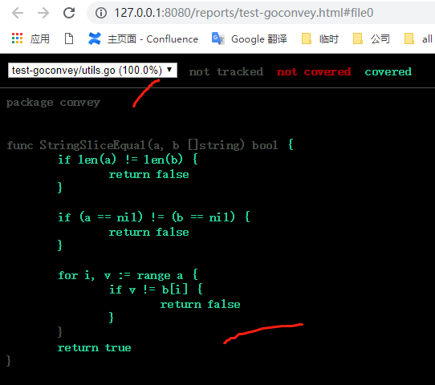

# test-goconvey

Use goconvey to do the first test program

##start

1. go get github.com/smartystreets/goconvey
2. write test code
```golang
func TestStringSliceEqual(t *testing.T) {
	Convey("TestStringEqual", t, func() {
		Convey("should return true when a == b", func() {
			a := "hello goconvey"
			b := "hello goconvey"
			So(a, ShouldBeTrue,b)
		})
	})
}
```
3. execute goconvey: in the directory where the test file is located
```log
PS D:\source\gopath\src\test-goconvey> goconvey
2019/05/04 00:31:26 goconvey.go:61: Initial configuration: [host: 127.0.0.1] [port: 8080] [poll: 250ms] [cover: true]
2019/05/04 00:31:27 tester.go:19: Now configured to test 10 packages concurrently.
2019/05/04 00:31:27 goconvey.go:178: Serving HTTP at: http://127.0.0.1:8080
2019/05/04 00:31:27 goconvey.go:105: Launching browser on 127.0.0.1:8080
2019/05/04 00:31:27 integration.go:122: File system state modified, publishing current folders... 0 3113800481
2019/05/04 00:31:27 goconvey.go:118: Received request from watcher to execute tests...
2019/05/04 00:31:27 goconvey.go:111: exec: "start": executable file not found in %PATH%
2019/05/04 00:31:27 goconvey.go:113:
2019/05/04 00:31:29 executor.go:69: Executor status: 'executing'
2019/05/04 00:31:29 coordinator.go:46: Executing concurrent tests: test-goconvey
2019/05/04 00:31:33 parser.go:24: [passed]: test-goconvey
2019/05/04 00:31:33 executor.go:69: Executor status: 'idle'
```
4. view in browse: http://localhost:8080


5. help: goconvey -h
```
Usage of D:\source\gopath\bin\goconvey.exe:
  -cover
        Enable package-level coverage statistics. Requires Go 1.2+ and the go cover tool. (default true)
  -depth int
        The directory scanning depth. If -1, scan infinitely deep directory structures. 0: scan working directory. 1+: Scan into nested directories, limited to value. (default -1)
  -excludedDirs string
        A comma separated list of directories that will be excluded from being watched (default "vendor,node_modules")
  -gobin string
        The path to the 'go' binary (default: search on the PATH). (default "go")lt "go")
  -host string
        The host at which to serve http. (default "127.0.0.1")
  -launchBrowser
        toggle auto launching of browser (default: true) (default true)
  -packages int
        The number of packages to test in parallel. Higher == faster but more costly in terms of computing. (default 10)
  -poll duration
        The interval to wait between polling the file system for changes. (default 250ms)
  -port int        The port at which to serve http. (default 8080)
  -timeout string
        The test execution timeout if none is specified in the *.goconvey file (default is '0', which is the same as not providing this option). (default "0")
  -watchedSuffixes string
        A comma separated list of file suffixes to watch for modifications. (default ".go")  -workDir string        set goconvey working directory (default current directory)
```


